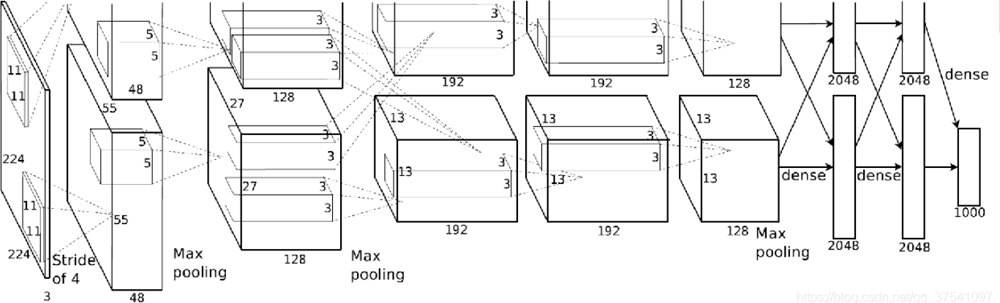
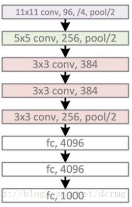

# AlexNet

## dataset

ImageNet

## Architecture

## highlight

1. ReLU
   $$
   f(x) =\max(0,x)
   $$

2. 多GPU运行

3. LRN
   $$
   b_{x,y}^i = a_{x,y}^i / \bigg{(} k+\alpha \sum_{j=\max{(0,i-n/2)}}^{\min(N-1,i+n/2)} (a_{x,y}^j)^2 \bigg{)}^\beta
   $$

4. 重叠池化

5. 在全连接层前两层使用Dropout方法，减少过拟合

