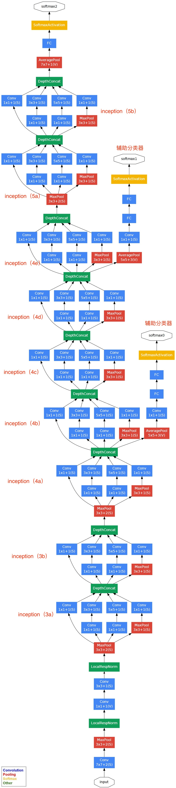
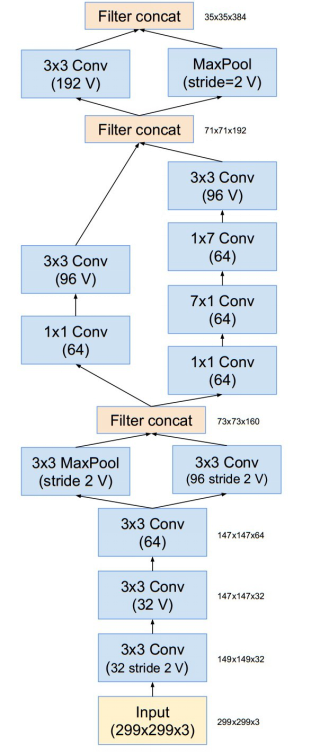

# LeNet

## Dataset

MNIST

## Architecture

* 输入层：图像大小 **32x32x1**
* 卷积层：filter大小 5x5，深度 6，padding为0，步长为1，输出大小 28x28x6
* 池化层：filter大小 2x2，步长 2，no padding，输出大小 14x14x6
* 卷积层：filter大小 5x5，深度 16，padding为0，步长为1，输出大小10x10x16
* 池化层：filter大小 2x2，步长 2，no padding，输出大小 5x5x16
* Flatten层：将5x5x16矩阵拉成400维向量
* FC层：neuron为120，激活函数tanh
* FC层：neuron为84，激活函数tanh
* 输出层（FC层）：neuron为10，激活函数softmax

## Highlight

1. 定义了CNN基本框架：卷积层+池化层+全连接层
2. 定义了卷积层（局部链接、权值共享）
3. 用Tanh作为非线性激活函数

## Reference

[Gradient-based learning applied to document recognition_1998](https://link.zhihu.com/?target=http%3A//202.116.81.74/cache/7/03/yann.lecun.com/b1a1c4acb57f1b447bfe36e103910875/lecun-01a.pdf)

# AlexNet

## dataset

ImageNet

## Architecture

## Highlight

1. ReLU
   $$
   f(x) =\max(0,x)
   $$

2. 多GPU运行

3. LRN
   $$
   b_{x,y}^i = a_{x,y}^i / \bigg{(} k+\alpha \sum_{j=\max{(0,i-n/2)}}^{\min(N-1,i+n/2)} (a_{x,y}^j)^2 \bigg{)}^\beta
   $$

4. 重叠池化

5. 在全连接层前两层使用Dropout方法，减少过拟合

## Reference

[ImageNet Classification with Deep Convolutional Neural Networks_2012](https://papers.nips.cc/paper/2012/file/c399862d3b9d6b76c8436e924a68c45b-Paper.pdf)

# VGG

由Oxford的Visual Geometry Group组提出

## Dataset

ILSVRC 2014

## Architecture

## Highlight

* 采用连续的几个3x3的卷积核代替AlexNet中的较大卷积核(11x11, 7x7, 5x5)

  > 使用3个3x3卷积核代替7x7卷积核，使用2个3x3卷积核来代替5x5卷积核

* 深度加深

## Reference

[VGG_paper](https://arxiv.org/abs/1409.1556)

# GooLeNet

## Dataset

ILSVRC14

## Architecture

输入层：输入图像为224x224x3，且都进行了零均值化的预处理操作

第一层（卷积层）：卷积核7x7（步长为2，padding为3），64通道，输出为112x112x64，卷积后ReLU；3x3的max pooling（步长为2），输出为((112-3+1)/2)+1=56，即56x56x64，再ReLU

第二层（卷积层）：卷积核3x3（步长为1，padding为1），192通道，输出为56x56x192，卷积后ReLU；3x3的max pooling（步长为2），输出为((56-3+1)/2)+1=28，即28x28x192，再ReLU

3a、第三层（Inception 3a层）：

分为四个分支，采用不同尺度的卷积核来处理：

1. 64个1x1卷积核，然后ReLU，输出28x28x64
2. 96个1x1卷积核，作为3x3卷积核的降维，变为28x28x96，然后ReLU，再进行128个3x3卷积(padding为1)，输出为28x28x128
3. 16个1x1卷积核，作为5x5卷积核的降维，变为28x28x16，然后ReLU，再进行32个5x5的卷积(padding为2)，输出为28x28x32
4. pool层，3x3卷积核(padding为1)，输出为28x28x192，然后进行32个1x1卷积，输出28x28x32

将四个结果进行连接，64+128+32+32=256，最终输出为28x28x256

3b、第三层(Inception 3b层)

1. 128个1x1的卷积核，然后ReLU，输出28x28x128
2. 128个1x1的卷积核，作为3x3卷积核的降维，变为28x28x128，然后ReLU，再进行192个3x3的卷积(padding为1)，输出28x28x192
3. 32个1x1的卷积核，作为5x5卷积核的降维，变为28x28x32，然后ReLU，再进行96个5x5的卷积(padding为2)，输出28x28x96
4. pool层，3x3的卷积核(padding为1)，输出28x28x256，然后64个1x1的卷积，输出为28x28x64

将四个结果进行连接，128+192+96+64=480，最终输出为28x28x480

第四层、第五层与3a、3b类似。

### Inception V1

最原始Inception的基本结构：

将卷积（1x1, 3x3, 5x5）、池化操作（3x3）堆叠在一起（卷积、池化后的尺寸相同，将通道相加），一方面增加了网络的宽度，另一方面也增加了网络对尺度的适应性。

但原始结构所需计算量太大，造成了特征图的厚度很大，为了避免这种情况，在3x3、5x5、max pooling后分别加上了1x1的卷积核，以起到了降低特征图厚度的作用，这就形成了Inception V1的网络结构：

1x1卷积：减少维度，减少参数

### Inception V2

1. 卷积分解

   用2个连续的3x3卷积层代替单个的5x5卷积层（保持感受野范围的同时又减少了参数量）

   用1xn和nx1卷积核代替nxn卷积核

2. 降低特征图大小

   方法1：先池化再Inception卷积（导致特征缺失）

   方法2：先Inception卷积再池化（正常缩小，计算量大）

### Inception V3

inception模块之间特征图的缩小，主要有下面两种方式：

V3采用了一种并行的降维结构：

具体来说，就是在35/17/8之间分别采用下面这两种方式来实现特征图尺寸的缩小：

### Inception V4

利用残差连接(Residual Connection)来改进V3结构，得到Inception-ResNet-v1，Inception-ResNet-v2，Inception-v4网络

Stem模块：

Inception-A模块（35x35网络模块）：

Inception-B模块（17x17网络模块）：

Inception-C模块（8x8网络模块）：

Reduction-A模块（35x35变为17x17）：

Reduction-B模块（17x17变为8x8）：

## Reference

[GooLeNet(从Inception v1到v4的演进)](https://my.oschina.net/u/876354/blog/1637819)

[图像CV之3——GooLeNet(Inception v1—Inception v4)](https://zhuanlan.zhihu.com/p/73828787)