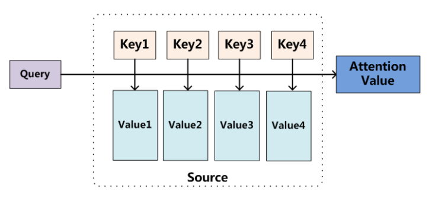
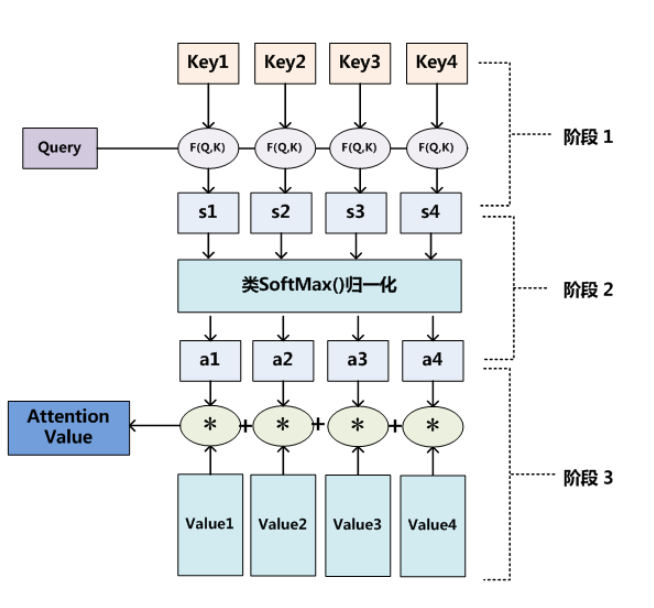

# Attention

## 本质思想

Attention机制本质思想：

$$
Source = <x_1, x_2, \dots, x_m> \\
Target = <y_1, y_2, \dots, y_n>
$$

Source构成：想象成由一系列的<Key, Value>数据对构成。

此时，给定Target中的某个元素Query，通过计算Query和各个Key的相似性或者相关性，得到每个Key对应Value的权重系数，然后对Value进行加权求和，即得到最终的Attention数值。

> Attention机制是对Source中元素的Value值进行加权求和，而Query和Key用来计算对应Value的权重系数

$$
Attention(Query,Source) = \sum_{i=1}^{L_x} Similarity(Query, Key_i) * Value_i
$$

其中，$L_x = ||Source||$代表Source的长度。

## 理论理解

从概念上理解，把Attention理解为从大量信息中有选择地筛选出少量重要信息并聚焦到这些重要信息上，忽略大多不重要地信息。（聚焦地过程体现在权重系数地计算上，权重代表了信息的重要性）

可以将Attention机制看作一种软寻址（Soft Addressing）:Source可以看作存储器内存储的内容，元素由地址Key和值Value组成，当前有个Key=Query的查询，目的是取出存储器中对应的Value值，即Attention数值。通过Query和存储器内元素Key的地址进行相似性比较来寻址，之所以说是软寻址，指的不像一般寻址只从存储内容里面找出一条内容，而是可能从每个Key地址都会取出内容，取出内容的重要性根据Query和Key的相似性来决定，之后对Value进行加权求和，这样就可以取出最终的Value值，也即Attention值。

## 具体计算过程

第一阶段：根据Query和Key计算两者的相似性或者相关性

>求值方式：
>$$
>点积： Similarity(Query, Key_i)=Query \cdot Key_i \\
>Cosine 相似性： Similarity(Query, Key_i) = \frac{Query \cdot Key_i}{||Query||\cdot||Key_i||} \\
>MLP网络： Similarity(Query, Key_i) = MLP(Query, Key_i)
>$$
>

第二阶段：对第一个阶段的原始分值进行归一化处理

> $$
> a_i=Softmax(S_i)=\frac{e^{S_i}}{\sum_{j=1}^{L_x} e^{S_j}}
> $$

第三阶段：根据权重系数对Value进行加权求和

> $$
> Attention(Query, Source) = \sum_{i=1}^{L_x} a_i \cdot Value_i
> $$

# Attention种类

## 计算区域

根据Attention的计算区域（即计算Key的个数）

### Soft Attention

对所有Key求权重概率，每个Key都有一个对应的权重，是一个全局的计算方式（也叫Global Attention）。

普通模式(Key = Value = X) 和 键值对模式(Key != Value) 

优点：参考了所有Key的内容，再进行加权

缺点：计算量大

### Hard Attention

直接精准定位到某个Key，其余Key就都不管了，相当于这个Key的概率为1，其余Key概率为0。

优点：一步到位

缺点：如果没有正确对齐，会带来很大影响。

### Local Attention

上述两种方式的折中，对一个窗口区域进行计算。

先用Hard方式定位到某个地方，以这个点为中心可以得到一个窗口区域，在这个小区域内用Soft方式来计算Attention。

## 所用信息

假设对一段原文计算Attention，原文指的是做Attention的文本，那么所用信息包括内部信息和外部信息，内部信息指的是原文本身的信息，外部信息指的是除原文以外的额外信息。

### General Attention

利用了外部信息，常用于需要构建两段文本关系的任务，query一般包含了额外信息，根据外部Query对原文进行对齐。

### Self Attention

也叫Local Attention，这种方式只使用内部信息，Key和Value以及Query只和输入原文有关。

在Self Attention中，Key=Value=Query。（相当于寻找原文内部的联系）
$$
Q = W_Q X \\
K = W_K X \\
V = W_V X
$$

## 结构层次

### 单层Attention

用一个Query对一段原文进行一次attention

### 多层Attention

一般用于文本具有层次关系的模型。

假设把一个document划分成多个句子，在第一层，对每个句子使用attention计算出一个句向量（也就是单层attention）；在第二层，对所有句向量再做attention计算出一个文档向量（也是一个单层attention）；最后再用这个文档向量去做任务。

### 多头Attention

Attention is All You Need提到的Multi-head attention。

用多个Query对一段原文进行多次attention，每个Query都关注到原文的不同部分，相当于重复做多次单层attention：
$$
head_i = Attention(q_i, K, V)
$$
最后再把这些结果拼接起来：
$$
MultiHead(Q,K,V)=Concat(head_1, \dots , head_h)W^O
$$

# Reference

[一文看懂Attention](https://medium.com/@pkqiang49/%E4%B8%80%E6%96%87%E7%9C%8B%E6%87%82-attention-%E6%9C%AC%E8%B4%A8%E5%8E%9F%E7%90%86-3%E5%A4%A7%E4%BC%98%E7%82%B9-5%E5%A4%A7%E7%B1%BB%E5%9E%8B-e4fbe4b6d030)

[深度学习中的注意力机制](https://blog.csdn.net/tg229dvt5i93mxaq5a6u/article/details/78422216)